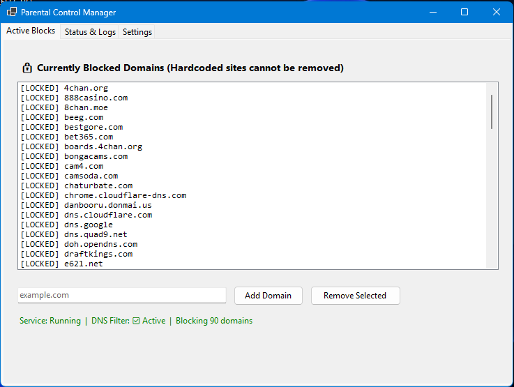

# 🛡️ Parental Control Tool

A lightweight, robust Windows-native security application designed to monitor and restrict access to inappropriate online content. It runs silently as a background service, using a multi-layered defense strategy — hosts file management, HTTP proxy interception, browser extension blocking, and process monitoring — optimized for office environments.

## ⚠️ Disclaimer

**Legal and Ethical Use:** This software is provided "as-is" and is intended *strictly* for parents or legal guardians monitoring minor children on devices they legally own and control.

---

## Table of Contents

- [Screenshots](#-screenshots)
- [Key Features](#-key-features)
- [Prerequisites](#️-prerequisites)
- [Installation](#-installation)
- [Configuration & Usage](#️-configuration--usage)
- [Uninstallation](#️-uninstallation)
- [Contributing](#-contributing)
- [License](#-license)

---

## 📸 Screenshots

## 🚀 Key Features

| Feature | Description |
|---|---|
| Multi-layered blocking | Hardcoded list of 60+ adult, gambling, and violence-related domains, plus 20+ torrent sites, with keyword-based filtering |
| Video file blocking | Blocks all video formats (`.mp4`, `.mkv`, `.avi`, `.mov`, `.flv`, `.webm`, and 35+ more) via HTTP proxy interception and packet inspection |
| Hosts file protection | Rewrites the system hosts file every 30 seconds — prevents bypass via manual hosts edits or DNS changes |
| Browser extension blocking | Disables all extensions in Chrome, Edge, Firefox, Opera, Brave, and Vivaldi; new installs blocked via Group Policy |
| Bypass prevention | Continuously monitors and terminates VPN, proxy, and specialized browser processes (e.g. Tor, Brave) |
| Persistent service | Runs as a Windows Service 24/7 — re-enforces hosts file every 30s and HTTP proxy every 60s |
| Administrative control | Password-protected Management GUI for adding/removing custom blocks and monitoring status |
| Audit logging | Tracks blocked attempts and bypass activity in the Windows Event Log |

## ⚙️ Prerequisites

- **OS:** Windows 10 or Windows 11
- **Framework:** [.NET 8.0 SDK](https://dotnet.microsoft.com/en-us/download/dotnet/thank-you/sdk-8.0.419-windows-x64-installer) (install the SDK, not just the Runtime)
- **Permissions:** Administrator privileges are strictly required

## 📥 Installation

1. Clone or download this repository to your local machine
2. Navigate to the extracted folder
3. Right-click `INSTALL.bat` and select **Run as Administrator**
4. Wait for the PowerShell script to build and install the service — green `[OK]` messages indicate success
5. A "Parental Control" shortcut will automatically appear on your Desktop

> **Note:** If the installer stops or shows red `[FAILED]` messages, check `install.log` in the root directory. Common causes: missing .NET 8 SDK or antivirus interference.

## 🖥️ Configuration & Usage

Once installed, blocking begins immediately.

1. Open the **Parental Control** app from your Desktop shortcut
2. Sign in with the admin password (set in the source — see `Program.cs`)
3. Use the GUI to:
   - Monitor live protection status (DNS, Proxy, Extensions, VPN blocking)
   - View recent audit log entries
   - Add or remove custom domain blocks (requires password)
   - Force re-enforce all protections

> ⚠️ **Security note:** The admin password is currently hardcoded in the source. If this repo is public, treat that password as compromised — rotate it in the code and avoid committing credentials in plain text going forward (consider an environment variable or a hashed/config-based check instead).

## 🛡️ Uninstallation

1. Navigate to the repository folder
2. Right-click `UNINSTALL.bat` and select **Run as Administrator**
3. Confirm any prompts

This removes the background service and all blocking rules.

## 🤝 Contributing

Contributions, issues, and feature requests are welcome!

1. Fork the repository
2. Create your feature branch (`git checkout -b feature/AmazingFeature`)
3. Commit your changes (`git commit -m 'Add some AmazingFeature'`)
4. Push to the branch (`git push origin feature/AmazingFeature`)
5. Open a Pull Request

## 📄 License

Distributed under the MIT License. See `LICENSE` for details.
